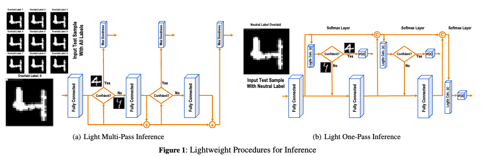

# Lightweight Inference for Forward-Forward Training Algorithm

We apply our proposed lightweight inference in the context of three state-of-the-art techniques, namely, the Forward-Forward Algorithm[1] (Multi-Pass [MP] and One-Pass [OP]) and PEPITA[2] [PT].

Code to run the simulations of the paper: 
**Lightweight Inference for Forward-Forward Training Algorithm**. Taking MNIST as an example, the codes are shown as follows:

- Lightweight-MP-MNIST: ``python Lightweight-FF/Lightweight-MP/main.py``
- Lightweight-OP-MNIST: ``python Lightweight-FF/Lightweight-OP/main.py``
- Lightweight-PEPITA-MNIST: ``python Lightweight-PT/pepita_MNIST.py``

Lightweight-FF is based on [loewex's FF implementation](https://github.com/loeweX/Forward-Forward). Lightweight-PT is based on [GiorgiaD's PT implementation](https://github.com/GiorgiaD/PEPITA). 

> In the ``./test`` folder, we also provide the lightweight inference code based on [mpezeshki's FF implementation](https://github.com/mpezeshki/pytorch_forward_forward), as a test version.

[1] Hinton, Geoffrey. "The forward-forward algorithm: Some preliminary investigations." arXiv preprint arXiv:2212.13345 (2022).

[2] Dellaferrera, Giorgia, and Gabriel Kreiman. "Error-driven input modulation: solving the credit assignment problem without a backward pass." International Conference on Machine Learning. PMLR, 2022.

